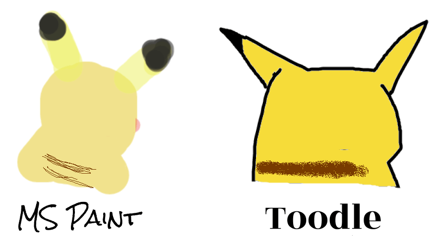

# Toodle Rails Backend (DEPRECATED)
This is the Rails Backend of Toodle which has been deprecated. 
Access the frontend **[here](https://github.com/PeaWarrior/Toodle-frontend)**.

We realized the many limitations that having auth set up on a web application like Toodle is not very user accessible. 
Currently, our live website of **[Toodle](https://toodlepaint.herokuapp.com/)** has been refactored to utilize localStorage for easier user accessibility.
## Comparison

You decide.
